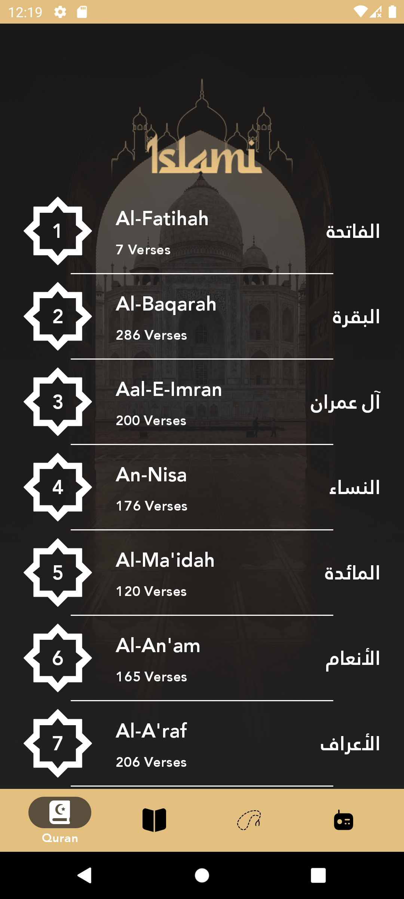
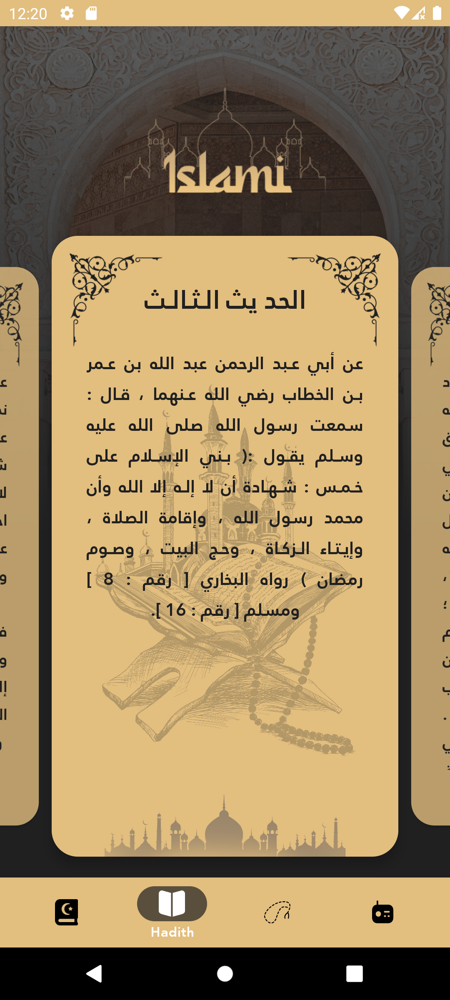
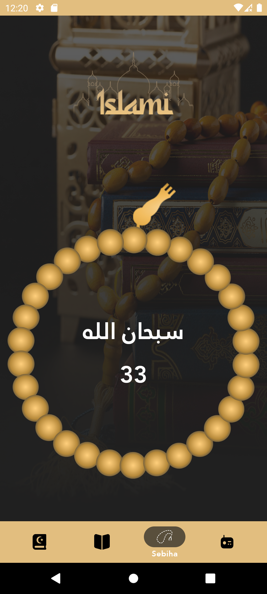

# Islami - Your Companion App

Islami is an Android application designed to provide users with essential Islamic resources and
tools in a beautifully designed interface. The app offers easy access to the Holy Quran, Hadith, and
a digital Sebiha counter.

## Features

* **Quran Karim:**
    * Browse and read Surah of the Holy Quran.
    * Each Surah is listed with its name in Arabic and transliteration, along with the verse count.
    * Clean and readable interface for an enhanced reading experience.
    <br/>
    
    <br/>

* **Hadith Collection:**
    * Access a collection of Hadith.
    * Read the text of various Hadith presented in an accessible format.
    <br/>
    
    <br/>

* **Digital Sebiha:**
    * A digital rosary to help you keep track of your dhikr (remembrance of Allah).
    * Features a traditional bead design with a counter.
    * Increment the count with a simple tap on the screen.
    <br/>
    
    <br/>

* **User-Friendly Navigation:**
    * Intuitive bottom navigation bar to easily switch between Quran, Hadith, Sebiha, and other
      sections.

## App Demo

Watch a quick demonstration of the app in action:

<br/>

<br/>

## Tech Stack & Libraries

This project likely utilizes a modern Android development stack:

* **Language:** Kotlin
* **UI Framework:** Android XML with Material Components, or Jetpack Compose.
* **Navigation:** Android Navigation Component for navigating between screens/fragments.
* **Data Handling:**
    * Reading Quran and Hadith data from local assets (`.txt` files, JSON) or a local database (
      e.g., Room).
* **View Binding / Data Binding:** To interact with UI elements efficiently.

## Getting Started

To get a local copy up and running, follow these simple steps:

1. **Clone the repository:**
   ```bash
   git clone https://github.com/Menna120/Islami.git
   ```
2. **Open in Android Studio:**
    * Open Android Studio (latest stable version recommended).
    * Select "Open an Existing Project" and navigate to the cloned directory.
3. **Build the project:**
    * Allow Android Studio to download Gradle dependencies and sync the project.
    * Click on "Build" > "Make Project".
4. **Run the app:**
    * Select a target device (emulator or physical device).
    * Click on "Run" > "Run 'app'".

---
